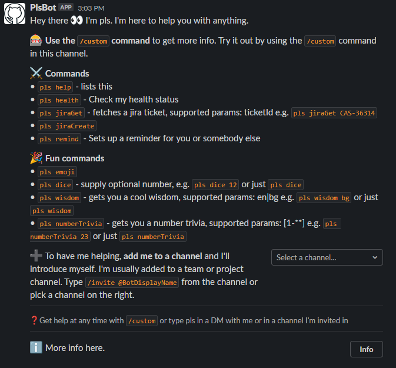

# Slack Bot Showcase
# 

## [Join me in slack to play around with the bot](https://join.slack.com/t/testing-gtv5991/shared_invite/zt-1gdat138l-UaKRmo6zT4D2GZURgu182w)

## Requires NodeJS >= 15.4.0

1. Endpoints:
    - /_healthcheck
    - /_config
    - /_upcheck

2. Technologies
    - uses websockets for comms with slack's api
    - uses http for comms with Jira
    - uses http for comms with Bitbucket (TODO)
    - uses hot utils's logger for logging 

3. Personal information
    - information kept - NONE
    - user information planned to be used - user's email and username for Jira/Bitbucket in HTTP outgoing requests

4. Setup in slack apps:
    - Navigate to the OAuth & Permissions on the left sidebar and scroll down to the Bot Token Scopes section. Click Add an OAuth Scope.
    - Add scopes (more here: https://api.slack.com/scopes):
        - chat:write
        - channels:history
        - channels:read
        - channels:write
        - channels:join
        - app_mentions:read
        - users.profile:read
        - commands (commands to be enabled beforehand -> navigate to slash commands from left side panel -> enable -> add /yourCustomCommand  command -> put your desired description)
        - connections:write (Grants permission to generate websocket URIs and connect to Socket Mode which this bot will primarily use)
        - groups:read
        - groups:write
        - im:read
        - im:write
        - mpim:read
        - mpim:write"
    - Scroll up to the top of the OAuth & Permissions page and click Install App to Workspace. You’ll be led through Slack’s OAuth UI, where you should allow your app to be installed to your development workspace.
    - Take note of Bot User OAuth Access Token (SLACK_BOT_TOKEN)
    - Copy your Signing Secret from the Basic Information page (SLACK_SIGNING_SECRET)
    - Setting up events
        - Head to your app’s configuration page (click on the app from your app management page). Navigate to Socket Mode on the left side menu and toggle to enable.
        - Go to Basic Information and scroll down under the App Token section and click Generate Token and Scopes to generate an app token. Add the connections:write scope to this token and save the generated xapp token (SLACK_APP_TOKEN).
    - Finally, it’s time to tell Slack what events we’d like to listen for. Under Event Subscriptions, toggle the switch labeled Enable Events.
        - Scroll down to Subscribe to Bot Events. add the following bot user events:
            - message.channels listens for messages in public channels that your app is added to
            - message.groups listens for messages in 🔒 private channels that your app is added to
            - message.im listens for messages in your app’s DMs with users
            - message.mpim listens for messages in multi-person DMs that your app is added to
            - team_join
            - app_mentions
        - After done adding the events CLICK ON SAVE CHANGES and reinstall the app

    - Always show my bot as online Features -> App Home

